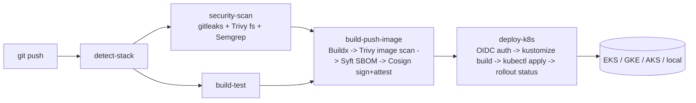

# Architecture

## Request flow: a push to `main`

Every arrow is a required dependency (`needs:` in `reusable-ci-cd.yml`) — a scan failure or a
failed rollout stops the pipeline instead of leaving a bad image reachable or a broken rollout
half-applied.

## Why both Kustomize *and* an operator exist

They're two interfaces onto the same object shape (Deployment/Service/ServiceAccount/HPA/PDB), not
competing designs:

- **Kustomize** (`k8s/app/`) is the right choice when platform and application teams both need to
  read and patch raw Kubernetes YAML — GitOps tools (Argo CD/Flux) reconcile it directly, and
  `kubectl diff` shows exactly what changes.
- **The operator** (`k8s/operator/`) is the right choice once you have enough application teams
  that hand-maintained Kustomize overlays become the platform team's support burden — one
  `AppWorkload` CR replaces ~8 files, and the reconcile loop self-heals drift (`kubectl edit
  deployment` gets reconciled back) the way a one-shot `kubectl apply` doesn't.

Neither is deployed by default in the CI/CD pipeline — `deploy-k8s` applies the Kustomize overlay,
because that's the correct default for a template with no assumption about whether a given
consuming org has adopted the operator. Point it at `k8s/operator/config/default` +
per-app `AppWorkload` CRs instead if your org has.

## Why the cloud boundary sits where it does

Three places branch on `cloud`, and only three:

1. **`.github/actions/{build-push-image,deploy-k8s}`** — registry auth and cluster credential
   retrieval genuinely differ per cloud (ECR vs. Artifact Registry vs. ACR; `aws eks
   update-kubeconfig` vs. `get-gke-credentials` vs. `aks-set-context`).
2. **`k8s/app/overlays/<cloud>`** — the workload-identity annotation, ingress class, and the
   ingress-controller's namespace differ per cloud/cluster.
3. **`terraform/modules/<cloud>/*`** — obviously; a VPC and an EKS cluster share no API surface
   with a VNet and an AKS cluster.

Everything else — the Dockerfiles, the base Kustomize manifests, the operator's reconcile logic,
the pipeline's stage sequencing — has **zero** cloud-conditional code. That's a deliberate
constraint, not an accident: if you find yourself adding an `if cloud == "aws"` outside those three
places, that's a signal the abstraction is leaking and the fix belongs in one of the three, not a
fourth branch point.

## Why NetworkPolicy's default egress rule allows `0.0.0.0/0:443`

`k8s/app/base/networkpolicy.yaml` denies all ingress/egress by default, then allows DNS and HTTPS
egress broadly (minus the cloud metadata IP). That's the right *starting* posture for a reusable
template whose author has no idea what external APIs a given workload calls — a template that
shipped with an empty egress allowlist would just get "temporarily" disabled by the first team that
hit it, which is worse than a documented, narrow-by-default rule. Narrow it to a real destination
IP/CIDR allowlist per workload once you know what it actually talks to; the comment in that file
says so explicitly.

## Why the local overlay isn't just "the same thing with smaller numbers"

`k8s/app/overlays/local` also drops `HorizontalPodAutoscaler.minReplicas` and
`PodDisruptionBudget.minAvailable` to match `replicas: 1` — a single-node kind/k3d cluster can't
satisfy the base's zone/host topology spread, and leaving the HPA floor at 2 would leave the
Deployment permanently "not enough replicas" on a laptop. This is the one overlay where the goal is
"runs on a laptop today," not "matches production's resilience posture at 1/10th scale" — treat it
as a dev-loop convenience, not a template for how `local` behaves in an on-prem/bare-metal
*production* cluster (which should look like the `aws`/`gcp`/`azure` overlays with MetalLB in place
of a cloud load balancer — see `.claude/skills/metallb`).

## Why `k8s/platform/` is a composition of OSS, not a custom auto-remediation engine

`k8s/platform/` is the "detect and self-heal any cluster" layer. It deliberately owns **no bespoke
control logic** — it's PrometheusRules (detection), Kyverno policies (prevention at admission),
and configuration for battle-tested controllers (Node Problem Detector + Medik8s, Descheduler,
Cluster Autoscaler/Karpenter, cert-manager, KEDA, Argo Rollouts). ~80% of real incidents are
resolved by those controllers with zero custom code. The `kubernetes-troubleshooter` agent
(`/k8s-autopilot`) only handles the long tail, and only within a strict tier model:

- **Tier 1** (autonomous): a short allowlist of *reversible, single-object, PDB-aware* actions
  (`rollout undo`, force-delete a stuck-Terminating pod, restart CoreDNS, run image-GC on a
  DiskPressure node), gated by circuit breakers (3/target/hour, 10/cluster/10min → global pause,
  paused entirely while control-plane alerts fire).
- **Tier 2**: opens a GitOps PR — never applies a spec change directly.
- **Tier 3**: pages a human with a full diagnosis.

The boundary is the point: an auto-remediator acting on a wrong diagnosis during an incident turns
one outage into three, so anything that mutates *intent* (spec, RBAC, NetworkPolicy, namespace,
etcd) is never autonomous regardless of confidence. Full detail: `k8s/platform/README.md`.

## Why the platform never "scans" and why 1M pods means a fleet, not a big cluster

Nothing polls object-by-object — detection is watch/informer + Prometheus scrape (15–30s) +
event-exporter, so a controller watching every pod in a cluster holds *one* connection and a
rate-limited queue. One cluster's supported ceiling is ~5k nodes / ~150k pods; past that you run
the *same* `k8s/platform/` stack in every cluster via one ArgoCD `ApplicationSet` and aggregate
only the *signals* centrally (Mimir/Thanos + global Grafana), never the *control*. If the central
store is down, every cluster still self-heals locally. See `k8s/platform/fleet/README.md`.
